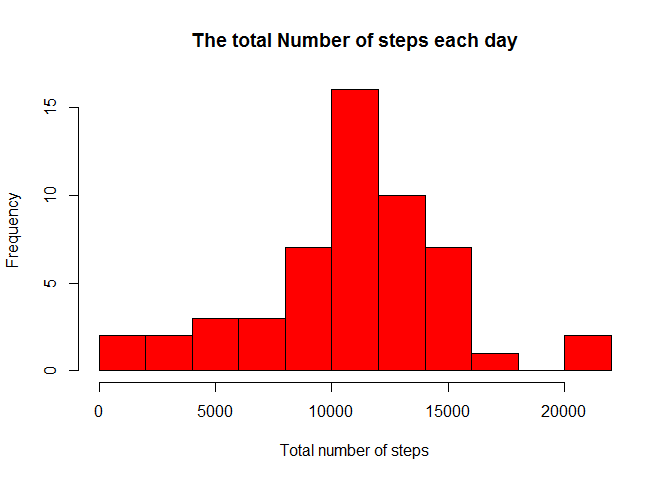
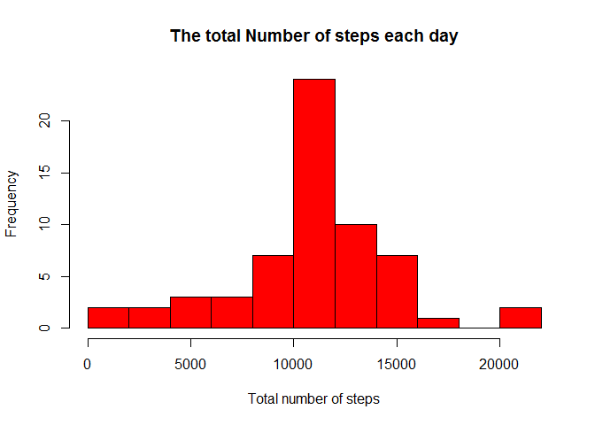
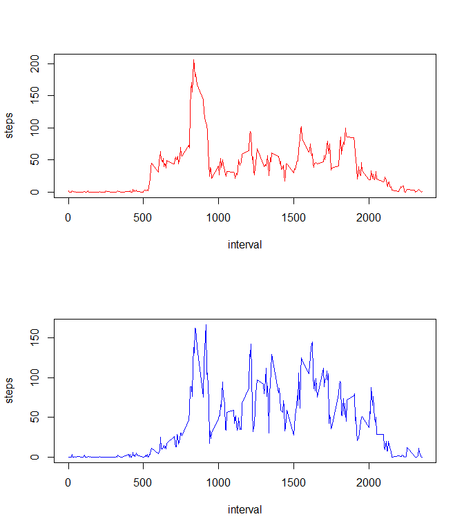

## Loading and preprocessing the data

```r
#read csv
dataActivity <- read.csv("activity.csv", header = TRUE, colClasses=c("numeric", "Date", "numeric"))
```


## What is mean total number of steps taken per day?
1. Calculate the total number of steps taken per day, plot histogramm

```r
#calculate total number of steps taken per day
TotalByDay <- with(dataActivity, aggregate(steps, by = list(date), sum) )
hist(TotalByDay$x, breaks = 10, col = "red", main = "The total Number of steps each day", 
    xlab = "Total number of steps")
```

<!-- -->

2. Calculate and report the mean and median of the total number of steps taken per day


```r
#calculate mean and median
TotalByDayMean <- mean(TotalByDay$x, na.rm = TRUE )
TotalByDayMedian <- median(TotalByDay$x, na.rm = TRUE)
```
Mean of the total number is 10766.1886792453  
Median of the total number is 10765

## What is the average daily activity pattern?
1.Plotting steps by interval of 5 minutes

```r
TotalByInterval <- with(dataActivity, aggregate(steps, by = list(interval), FUN = mean, na.rm = TRUE ) )
colnames(TotalByInterval) <- c("interval", "steps")
plot(TotalByInterval$interval , TotalByInterval$steps , type = "l", xlab = "interval", ylab = "steps", col = "red" )
```

<!-- -->

2.Interval wich contains the maximum number of steps

```r
maxInterval <- TotalByInterval[which.max(TotalByInterval$steps),]
```

Interval number 835 contains 206.1698113 steps

## Imputing missing values

 1.  Calculate and report the total number of missing values in the dataset

```r
missingVals <- sum(is.na(dataActivity$steps))
```
 There are 2304 missing values
 
 
 2.Filling in all of the missing values in the dataset. 
 

```r
dataActivityChanged <- dataActivity
dataActivityChanged$steps <- with(dataActivityChanged, ave(steps, interval, FUN = function(x) replace(x, is.na(x), mean(x, na.rm = TRUE))))
```
 
 3.  Make a histogram of the total number of steps taken each day and Calculate and report the mean and median total number of steps taken per day. 
 

```r
#calculate total number of steps taken per day
TotalByDayChanged <- with(dataActivityChanged, aggregate(steps, by = list(date), sum) )
hist(TotalByDayChanged$x, breaks = 10, col = "red", main = "The total Number of steps each day", 
    xlab = "Total number of steps")
```

<!-- -->

```r
#calculate mean and median
TotalByDayMeanChanged <- mean(TotalByDayChanged$x, na.rm = TRUE )
TotalByDayMedianChanged <- median(TotalByDayChanged$x, na.rm = TRUE)
```
 
Mean of the total number is 10766.1886792453  
Median of the total number is 10766.1886792453

The values are slitely different from those from the beginning with the missing values. There were 10766.1886792453 for mean and 10765 for median

## Are there differences in activity patterns between weekdays and weekends?


```r
#add the names of the days
dataActivityChanged$Days <- weekdays(as.Date(as.character(dataActivityChanged$date)))
#extract WDays
dataActivityWeekDay <- dataActivityChanged[dataActivityChanged$Days != "Saturday" | dataActivityChanged$Days != "Sunday", ]
#extract WEnds
dataActivityWeekEnds <- dataActivityChanged[dataActivityChanged$Days == "Saturday" | dataActivityChanged$Days == "Sunday", ]
#take mean by interval
TotalByIntervalWD <- with(dataActivityWeekDay, aggregate(steps, by = list(interval), FUN = mean, na.rm = TRUE ) )
colnames(TotalByIntervalWD) <- c( "interval","steps")

TotalByIntervalWE <- with(dataActivityWeekEnds, aggregate(steps, by = list(interval), FUN = mean, na.rm = TRUE ) )
colnames(TotalByIntervalWE) <- c( "interval","steps")
#plot both
par(mfrow = c(2,1))

plot(TotalByIntervalWD$interval , TotalByIntervalWD$steps , type = "l", xlab = "interval", ylab = "steps", col = "red" )
plot(TotalByIntervalWE$interval , TotalByIntervalWE$steps , type = "l", xlab = "interval", ylab = "steps", col = "blue" )
```

<!-- -->

